# OpenSynaptic

**2-N-2 高性能物联网协议栈** — 将传感器读数标准化为 UCUM 单位，通过 Base62 编码压缩，包装成二进制数据包，并通过可插拔的传输器分发（TCP / UDP / UART / LoRa / MQTT / CAN）。

## 📚 文档中心

🌍 **所有文档已移至我们的综合 Wiki。** 选择您的语言开始探索：

### 英文文档
- **[📖 完整导航](OpenSynaptic_Wiki/OpenSynaptic.wiki/Navigation-EN.md)** — 完整的英文文档索引
- **[🏠 Wiki 首页](OpenSynaptic_Wiki/OpenSynaptic.wiki/Home.md)** — 英文版首页
- **[🔍 完整索引](OpenSynaptic_Wiki/OpenSynaptic.wiki/en-INDEX.md)** — 所有 110+ 英文文档

### 中文文档
- **[📖 完整导航](OpenSynaptic_Wiki/OpenSynaptic.wiki/Navigation-ZH.md)** — 完整的中文文档索引
- **[🏠 Wiki 首页](OpenSynaptic_Wiki/OpenSynaptic.wiki/zh-Home.md)** — 中文版首页
- **[🔍 完整索引](OpenSynaptic_Wiki/OpenSynaptic.wiki/zh-INDEX.md)** — 所有 91+ 中文文档


## 30 秒快速开始

```powershell
pip install -e .
os-node demo --open-browser
```

Windows（无需 `Activate.ps1`）：

```powershell
.\run-main.cmd demo --open-browser
```

- 默认用户配置路径：`~/.config/opensynaptic/Config.json`
- 首次运行会启动向导（支持 `--yes` / `--no-wizard` 选项）

### CLI 命令补全（Tab）

```powershell
py -3 -m pip install argcomplete
powershell -ExecutionPolicy Bypass -File .\scripts\enable_argcomplete.ps1
```

手动配置（不需要脚本）：

```powershell
Invoke-Expression (register-python-argcomplete os-node --shell powershell)
```

重启 PowerShell 后生效。

---

## 目录

- [架构](#架构)
- [先决条件](#先决条件)
- [安装](#安装)
- [为什么选择 OpenSynaptic？](#为什么选择-opensynaptic)
- [性能概览](#性能概览)
- [应用场景](#应用场景)
- [最小化使用](#最小化使用)
- [CLI 快速参考](#cli-快速参考)
- [Config.json](#configjson)
- [测试](#测试)
- [本地和 Rust 构建](#本地和-rust-构建)
- [添加传输器](#添加传输器)
- [API 参考](#api-参考)
- [文档中心](#文档中心)
- [插件配置自动同步](#插件配置自动同步)

---

## 架构


**管道概述（文本）**：
```
传感器列表
    → OpenSynapticStandardizer.standardize()   # UCUM 标准化
    → OpenSynapticEngine.compress()            # Base62 实体压缩
    → OSVisualFusionEngine.run_engine()        # 二进制数据包 (FULL / DIFF 策略)
    → OpenSynaptic.dispatch(medium="UDP")      # 通过传输器物理发送
```

```
src/opensynaptic/
├── core/
│   ├── __init__.py             # 公共核心外观 + 活跃后端加载器
│   ├── pycore/
│   │   ├── core.py             # 协调器 – OpenSynaptic 类
│   │   ├── standardization.py  # UCUM 标准化
│   │   ├── solidity.py         # Base62 压缩/解压
│   │   ├── unified_parser.py   # 二进制数据包编码/解码，模板学习
│   │   ├── handshake.py        # CMD 字节分发，设备 ID 协商
│   │   └── transporter_manager.py # 自动发现可插拔传输器
│   ├── rscore/                 # Rust 核心后端 + 构建/检查帮助程序
│   ├── transport_layer/        # L4 协议管理器和协议/
│   ├── physical_layer/         # PHY 协议管理器和协议/
│   ├── layered_protocol_manager.py # 3 层协议编排
│   ├── coremanager.py          # 核心选择/运行时管理器
│   └── loader.py               # 核心/插件加载器
├── services/
│   ├── service_manager.py      # 插件挂载/加载/分发集线器
│   ├── plugin_registry.py      # 内置插件映射 + 配置默认同步
│   ├── tui/                    # 终端 UI 服务（部分感知、交互式）
│   ├── web_user/               # 轻量级 Web UI + 用户管理 API
│   ├── dependency_manager/     # 依赖检查/修复/安装插件
│   ├── env_guard/              # 环境保护服务
│   ├── transporters/           # 应用层传输器服务
│   ├── db_engine/              # 数据库集成服务
│   └── test_plugin/            # 内置组件和压力测试套件
├── utils/
│   ├── constants.py            # LogMsg 枚举，MESSAGES，CLI_HELP_TABLE
│   ├── logger.py               # os_log 单例
│   ├── paths.py                # OSContext，read_json，write_json，get_registry_path
│   ├── base62/                 # Base62 编码绑定/工具
│   ├── security/               # crc/xor/会话密钥帮助程序
│   └── c/                      # 本地加载器/构建帮助程序
├── CLI/
│   └── app.py                  # Argparse CLI（os-node 入口点）
plugins/
└── id_allocator.py             # uint32 ID 池，持久化到 data/id_allocation.json
libraries/
└── Units/                      # UCUM 单位定義 JSON 文件
scripts/
├── integration_test.py
├── udp_receive_test.py
├── audit_driver_capabilities.py
├── services_smoke_check.py
└── cli_exhaustive_check.py
Config.json                     # 所有运行时设置的单一信息源
```

---

## 先决条件

- Python 3.11+
- 可选：`mysql-connector-python`、`psycopg[binary]`、`aioquic`（见 `pyproject.toml`）

---

## 安装

```powershell
pip install -e .
```

### Windows PowerShell 启动注意

如果在激活虚拟环境时看到此错误：

```
Activate.ps1 cannot be loaded because running scripts is disabled on this system.
```

使用项目包装器，无需激活即可运行：

```powershell
.\scripts\venv-python.cmd -m pip install -e .
.\scripts\venv-python.cmd -m pytest tests/unit tests/integration -q
.\scripts\venv-python.cmd -u src/main.py --help
.\run-main.cmd --help
```

### 首次运行本地自动修复

首次运行时，OpenSynaptic 会在检测到缺少运行时库时自动尝试本地 C 绑定修复。

- **触发点**：首次运行启动预检查失败时
- **功能**：运行与 `native-build` 相同的本地构建管道，然后重试节点启动
- **需要编译器时**：返回结构化指导，并通过 `env_guard` 记录环境提示

仅在需要时禁用此行为：

```powershell
$env:OPENSYNAPTIC_AUTO_NATIVE_REPAIR = "0"
```

---

## 为什么选择 OpenSynaptic？

OpenSynaptic 不是 MQTT 或 CoAP 的替代品 — 它解决一个不同的问题。MQTT/CoAP 处理**传输**，而 OpenSynaptic 关注**在传感器数据进入网络之前对其的处理**。

### 真实问题

部署来自不同厂商的物联网传感器时，您面临三个普遍的困难：

| 问题 | 示例 |
|------|------|
| **单位混乱** | 传感器 A 发送 `"pressure": 101.3, "unit": "kPa"`，传感器 B 发送 `"p": 14.7, "u": "psi"` |
| **冗长编码** | `{"sensor_id": "temp_01", "value": 23.5, "unit": "celsius"}` → 62 字节用于 4 字节数据 |
| **传输碎片化** | 需要 TCP 保证可靠性，UDP 提高速度，LoRa 增加范围，CAN 用于汽车 — 五个不同的代码库 |

### OpenSynaptic 的优势

| 层 | 传统方法 | OpenSynaptic |
|---|------|------|
| **语义标准化** | 应用代码 | ✅ 内置 UCUM |
| **有效负载压缩** | 可选库（zlib/lz4） | ✅ 内置 Base62 + DIFF（相比 JSON 减少 60–80%） |
| **传输抽象** | 按介质重写代码 | ✅ 单一 API：TCP/UDP/LoRa/CAN/MQTT |
| **二进制编码** | 自定义或 Protobuf | ✅ 零拷贝管道 |

### 性能对比（生产环境）

| 指标 | MQTT + JSON | CoAP | **OpenSynaptic** |
|------|---------|------|---------|
| **处理延迟**（单传感器，Python） | ~150–300 μs | ~80–200 μs | **9.7 μs** |
| **吞吐量**（单核） | ~8K–15K ops/s | ~10K–20K ops/s | **1.2M ops/s** |
| **有效负载大小**（温度：23.5°C） | ~60 字节 | ~40 字节 | **~16 字节** |
| **压缩比**（相比 JSON） | N/A | N/A | **60–80% 减少** |

> ⚠️ **重要说明**：这些是**协议序列化**基准，**不是**端到端网络延迟。MQTT/CoAP 在网络往返时会增加 1–10 ms — OpenSynaptic 在真实网络上部署时也会增加相同延迟。优势在于**处理效率**，而非物理定律违反。

### 何时使用

| 如果需要... | 使用... |
|---------|----------|
| **标准 IoT 云连接**（AWS IoT、Azure IoT Hub） | MQTT |
| **基于 UDP 的 REST 式请求/响应** | CoAP |
| **传感器标准化 + 压缩 + 多传输一栈式** | **OpenSynaptic** |
| **受限硬件上的最大处理吞吐量** | **OpenSynaptic** |
| **已有工作中的 MQTT/CoAP 部署** | 保留使用，将 OpenSynaptic 作为预处理层 |

### 作为预处理器的 OpenSynaptic

OpenSynaptic 不强制放弃现有基础设施。将其用作 MQTT 的**预处理层**：

```python
# 标准化并压缩传感器数据，然后通过 MQTT 发送
node = OpenSynaptic()
packet, _, _ = node.transmit(sensors=[["temp", "OK", 23.5, "cel"]])
mqtt_client.publish("sensors/data", packet.hex())  # 16 字节而不是 60 字节
```

---

## ⚡ 性能概览一览

颜色图例：`R5 9600X = 活跃`、`i7-9750H = 严重`、`i7_9750H = 活跃`。

> **注意**：上面的图表使用用户提供的运行数据。由于运行配置不同（`total`、`processes`、`threads`、`batch`、`chain_mode`），请将其视为工程参考而非严格的 A/B 基准。

```mermaid
gantt
  title CPU 处理时间（按百分位数）（微秒）
  dateFormat x
  axisFormat %Q
  section AVG
  R5_9600X 10.7us   : a1, 0, 11
  RK3588 31.5us   :crit, a2, 0, 32
  i7_9750H 21.8us     :active, a3, 0, 22

  section P95
  R5_9600X 36.8us   :b1, 0, 37
  RK3588 88.4us   :crit, b2, 0, 88
  i7_9750H 54.7us     :active, b3, 0, 55

  section P99
  R5_9600X 68.6us   : c1, 0, 69
  RK3588 186.1us  :crit, c2, 0, 186
  i7_9750H 89.7us     :active, c3, 0, 90

  section P99.9
  R5_9600X 109.8us  : d1, 0, 110
  RK3588 461.2us  :crit, d2, 0, 461
  i7_9750H 192.9us    :active, d3, 0, 193

  section P99.99
  R5_9600X 109.8us  : e1, 0, 110
  RK3588 811.6us  :crit, e2, 0, 812
  i7_9750H 338.8us    :active, e3, 0, 339

  section MAX
  R5_9600X 141.5us  : f1, 0, 142
  RK3588 2012.9us :crit, f2, 0, 2013
  i7_9750H 436.4us    :active, f3, 0, 436
```



图表比例说明：条形显示的是大约微秒（us），方便按百分位数分组以加快 CPU 间对比。

> **注意**：此简化视图仅显示用户提供的 `batch_fused` 运行的总体单数据包 CPU 处理延迟。如果需要阶段级时序（`standardize_ms` / `compress_ms` / `fuse_ms`），请在单进程模式下使用 `--pipeline-mode legacy`。

### 遗留模式（精确的阶段级计时）

为了获得精确的阶段级细分，请使用 `--pipeline-mode legacy`，**仅单进程**：

```bash
python -u src/main.py plugin-test --suite stress --total 1 \
  --chain-mode core --pipeline-mode legacy --processes 1 --threads-per-process 1
```

**遗留模式管道计时细分：**


> **关键洞察**：融合（二进制数据包构建）在遗留模式中主导延迟；`batch_fused` 优化可显著减少瓶颈。

⚠️ **遗留模式注意事项：**
- 吞吐量人为降低（~1-5K pps），原因是结果收集器中的全局锁，不代表实际系统速度
- 延迟数据准确，但不要使用 pps 指标进行性能调优
- 请使用 `batch_fused`（上方）进行真实的性能分析

[完整基准报告](docs/reports/PERFORMANCE_OPTIMIZATION_REPORT.md)

---

## 应用场景

### 智慧农业（离线）
部署 $30 SBC 作为本地云，聚合 LoRa 传感器数据。无需互联网。

### 工业物联网（统一）
用单一 OpenSynaptic 栈替换多个专有协议，降低集成成本 50%。

### 隐私优先的智能家居
将所有传感器数据保留在本地 SBC；无需暴露数据给公有云即可通过移动应用控制。

---

## 最小化使用

```python
from opensynaptic.core import OpenSynaptic

node = OpenSynaptic()                        # 自动读取 Config.json
node.ensure_id("192.168.1.100", 8080)        # 从服务器请求设备 ID
packet, aid, strategy = node.transmit(sensors=[["V1", "OK", 3.14, "Pa"]])
node.dispatch(packet, medium="UDP")
```

```python
from opensynaptic.core import get_core_manager

manager = get_core_manager()
print(manager.available_cores())             # 例如 ['pycore', 'rscore']
manager.set_active_core('pycore')
OpenSynaptic = manager.get_symbol('OpenSynaptic')
```

---

## CLI 快速参考

所有命令可通过 `os-node`（已安装的入口点）、`./run-main.cmd`（Windows）或 `python -u src/main.py` 使用：

### 命令分类

- **运行时**：`run`、`restart`、`snapshot`、`ensure-id`、`transmit`、`inject`、`decode`、`watch`、`tui`
- **配置**：`config-show`、`config-get`、`config-set`、`core`、`transporter-toggle`
- **插件**：`plugin-list`、`plugin-load`、`plugin-cmd`、`web-user`、`deps`
- **测试**：`plugin-test`、`native-check`、`native-build`、`rscore-build`、`rscore-check`
- **监控**：`transport-status`、`db-status`、`help`

### 所有命令

| 分类 | 命令 | 说明 |
|------|------|------|
| **运行时** | `run` | 带心跳的持续运行循环 |
| **运行时** | `restart` | 优雅重启运行循环（停止 + 自动启动新进程） |
| **运行时** | `snapshot` | 打印节点/服务/传输器 JSON 快照 |
| **运行时** | `ensure-id` | 从服务器请求设备 ID |
| **运行时** | `transmit` | 编码一条传感器读数并分发 |
| **运行时** | `inject` | 通过管道阶段推送数据并检查输出 |
| **运行时** | `decode` | 解码二进制数据包（十六进制）或 Base62 字符串回 JSON |
| **运行时** | `watch` | 实时轮询模块状态（配置 / 注册表 / 传输 / 管道） |
| **运行时** | `tui` | 渲染 TUI 快照（添加 `--interactive` 进入实时模式） |
| **配置** | `config-show` | 显示 Config.json 或特定部分 |
| **配置** | `config-get` | 从 Config 读取点符号键路径 |
| **配置** | `config-set` | 将类型化值写入 Config 键路径 |
| **配置** | `core` | 显示/切换核心后端（`pycore` / `rscore`） |
| **配置** | `transporter-toggle` | 在 Config 中启用或禁用传输器 |
| **插件** | `plugin-list` | 列出已挂载的服务插件 |
| **插件** | `plugin-load` | 按名称加载已挂载的插件 |
| **插件** | `plugin-cmd` | 将子命令路由到插件的 CLI 处理器 |
| **插件** | `web-user` | 直接从 CLI 运行 web_user 插件 |
| **插件** | `deps` | 直接从 CLI 运行 dependency_manager 插件 |
| **测试** | `plugin-test` | 运行组件或压力测试 |
| **测试** | `native-check` | 检查本地编译器/工具链可用性 |
| **测试** | `native-build` | 构建本地 C 绑定（可选择包括 RS 核心） |
| **测试** | `rscore-build` | 构建并安装 Rust RS 核心共享库 |
| **测试** | `rscore-check` | 检查 RS 核心 DLL/运行时就绪状态和活跃核心 |
| **监控** | `transport-status` | 显示所有传输器层状态 |
| **监控** | `db-status` | 显示 DB 引擎状态 |
| **监控** | `help` | 打印完整帮助 |

完整使用示例 → [`src/opensynaptic/CLI/README.md`](src/opensynaptic/CLI/README.md)

---

## Config.json

项目根目录的 `Config.json` 是单一信息源。关键字段：

| 字段 | 类型 | 默认值 | 效果 |
|------|------|--------|------|
| `assigned_id` | uint32 | `4294967295` | 设备 ID；`4294967295` = 未分配 |
| `engine_settings.precision` | int | `4` | Base62 小数位 |
| `engine_settings.active_standardization` | bool | `true` | 启用 UCUM 标准化 |
| `engine_settings.active_compression` | bool | `true` | 启用 Base62 压缩 |
| `RESOURCES.transporters_status` | map | `{}` | 遗留的合并兼容性映射（镜像层特定状态映射） |
| `security_settings.drop_on_crc16_failure` | bool | `true` | CRC 校验失败时丢弃数据包 |

完整架构 → [docs/CONFIG_SCHEMA.md](docs/CONFIG_SCHEMA.md)

---

## 测试

**测试套件选项**：

| 套件 | 目的 | 命令 |
|------|------|------|
| `component` | 单元级组件测试 | `plugin-test --suite component` |
| `stress` | 大容量性能测试 | `plugin-test --suite stress --workers 8 --total 200` |
| `integration` | 端到端集成测试 | `plugin-test --suite integration` |
| `all` | 完整测试覆盖 | `plugin-test --suite all` |

**快速命令**：

```powershell
# Windows 快捷方式（无需 Activate.ps1）
.\run-main.cmd plugin-test --suite component

# 组件测试（单元级）
python -u src/main.py plugin-test --suite component

# 压力测试（高吞吐量）
python -u src/main.py plugin-test --suite stress --workers 8 --total 200

# 所有套件合并
python -u src/main.py plugin-test --suite all

# 如果测试失败，修复依赖项
python -u src/main.py deps --cmd check
python -u src/main.py deps --cmd repair

# 然后重试测试套件

# 其他测试脚本
python scripts/integration_test.py
python scripts/udp_receive_test.py --protocol udp --host 127.0.0.1 --port 8080 --config Config.json
python scripts/audit_driver_capabilities.py
python scripts/services_smoke_check.py
```

**全面可重复的管道**：

```powershell
# 全规模可重现验证（推荐默认）
python -u scripts/extreme_validation_pipeline.py --scale full

# 轻量级 CI 冒烟测试
python -u scripts/extreme_validation_pipeline.py --scale smoke

# 最大工作负荷，任何步骤失败则失败
python -u scripts/extreme_validation_pipeline.py --scale extreme --strict
```

运行器将单个聚合 JSON 报告写入：

`data/benchmarks/extreme_validation_report_latest.json`

它还会在 `data/benchmarks/` 下更新每个套件基准工件（比较、压力、协议矩阵、CLI 详尽报告）。

---

## 本地和 Rust 构建

**后端选项**：

| 后端 | 类型 | 需要工具链 | 最适合 |
|------|------|-----------|--------|
| `pycore` | 纯 Python | 可选（C 编译器） | 平衡，易于设置 |
| `rscore` | Rust + FFI | 必需（Rust + MSVC/Clang） | 最大性能 |

**快速开始**：

1. **检查您拥有什么**：
   ```powershell
   python -u src/main.py native-check      # 检查工具链可用性
   ```

2. **构建本地绑定**（用于 pycore）：
   ```powershell
   python -u src/main.py native-build      # 构建 C 绑定
   ```

3. **构建 Rust 后端**（可选，用于 rscore）：
   ```powershell
   python -u src/main.py rscore-build      # 构建 Rust 核心
   python -u src/main.py rscore-check      # 验证安装
   ```

4. **切换活跃核心**（持久化）：
   ```powershell
   # 使用 Rust 核心
   python -u src/main.py core --set rscore --persist
   
   # 或切换回 Python 核心
   python -u src/main.py core --set pycore --persist
   ```

**Windows 快捷方式**（无需 Activate.ps1）：

```powershell
.\run-main.cmd native-check
.\run-main.cmd native-build
```

---

## 添加传输器

见 [docs/TRANSPORTER_PLUGIN.md](../docs/TRANSPORTER_PLUGIN.md)（英文）。

---

## API 参考

见 [docs/API.md](../docs/API.md)（英文）。

核心 API 和加载器参考 → [docs/CORE_API.md](../docs/CORE_API.md)（英文）

---

## 文档中心

**所有文档**（均有中英文版本）：

- 仓库文档地图：[docs/INDEX.md](INDEX.md)
- 从这里开始：[README.md](README.md)
- 架构详解：[ARCHITECTURE.md](ARCHITECTURE.md)
- 配置架构：[docs/CONFIG_SCHEMA.md](../docs/CONFIG_SCHEMA.md)（英文）
- 传输器/插件扩展：[docs/TRANSPORTER_PLUGIN.md](../docs/TRANSPORTER_PLUGIN.md)（英文）
- ID 租赁系统：[ID_LEASE_SYSTEM.md](../docs/ID_LEASE_SYSTEM.md)（英文）
- 国际化支持：[docs/I18N.md](../docs/I18N.md)（英文）

---

## 插件配置自动同步

内置插件设置存储在 `Config.json` 的：

`RESOURCES.service_plugins.<plugin_name>`

这些条目会自动创建（带默认值）；插件保持手动启动，不会在进程启动时自动运行。

---

## 许可证

[Apache 2.0](LICENSE)

---

**语言支持**: [English (英文)](../README.md) | [简体中文](README.md)  
**最后更新**: 2026-04-04
