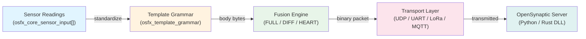

# OSynapptic-FX

**Embedded-first OpenSynaptic C99 runtime for Arduino** — encodes multi-sensor readings into a compact binary packet, sends FULL or delta-DIFF frames, and integrates directly with the [OpenSynaptic](../OpenSynaptic/README.md) server over any transport (UDP / TCP / UART / LoRa / MQTT / CAN).


## Try In 30 Seconds

```
Arduino IDE → Sketch > Include Library > Manage Libraries → search "OSynapptic-FX" → Install
File > Examples > OSynapptic-FX > EasyQuickStart → Upload
```

Arduino CLI:

```bash
arduino-cli lib install "OSynapptic-FX"
arduino-cli compile --fqbn esp32:esp32:esp32 examples/EasyQuickStart
arduino-cli upload  --fqbn esp32:esp32:esp32 -p /dev/ttyUSB0 examples/EasyQuickStart
```

Open Serial Monitor at **115200 baud** and watch binary DIFF packets stream out.

---

## Table of Contents

- [Why OSynapptic-FX](#why-osynapptic-fx)
- [Architecture](#architecture)
- [Memory Usage](#memory-usage)
- [Quick Start (Code)](#quick-start-code)
- [Tuning for Your Target](#tuning-for-your-target)
- [Binary DIFF Protocol](#binary-diff-protocol)
- [Examples](#examples)
- [Repository Map](#repository-map)
- [Precompiled Archives](#precompiled-archives)
- [Capability Snapshot](#capability-snapshot)
- [Documentation Index](#documentation-index)
- [Contributing](#contributing)
- [FAQ](#faq)

---

## Why OSynapptic-FX

- **DRAM-safe on ESP32**: default configuration fits in ~27 KB of DRAM; all limits are `#ifndef`-overridable at compile time.
- **Binary DIFF packets**: only changed sensor slots are transmitted — saves bandwidth on noisy multi-sensor nodes.
- **Spec-driven**: implementation is derived from the same OpenSynaptic protocol spec as the Python/Rust server, so packets decode without custom glue.
- **Zero dynamic allocation option**: set `OSFX_CFG_MULTI_SENSOR_STATIC_SCRATCH 1` and everything lives in static buffers.
- **Portable C99**: compiles clean on AVR, ESP32, STM32, RP2040, RISC-V, and bare-metal Cortex-M with `-Wall -Wextra`.

---

## Architecture



**Packet pipeline:**

```
osfx_core_sensor_input[]
  → osfx_template_grammar_encode()   # tag:value body bytes, UCUM normalised
  → osfx_fusion_encode()             # FULL (first) or binary bitmask DIFF (delta)
  → transport callback               # send over UDP / Serial / LoRa / …
```

The server side decodes via `OSVisualFusionEngine` + `codec.py` (OpenSynaptic project).

---

## Memory Usage

All figures are for ESP32 at default `osfx_user_config.h` settings (v0.2.0).

| Component | DRAM (BSS/DATA) | Notes |
|---|---|---|
| `osfx_easy_context` | ~14 KB | includes fusion state + template |
| ID allocator (`OSFX_ID_MAX_ENTRIES=128`) | ~5 KB | `id_entry` × 128 |
| Body scratch buffer (`BODY_CAP=512`) | 512 B | static when `STATIC_SCRATCH=1` |
| Total typical sketch | **~20 KB** | well within 160 KB DRAM limit |

> For tighter targets (AVR / Cortex-M0) reduce `OSFX_FUSION_MAX_ENTRIES` to 8–16 and `OSFX_ID_MAX_ENTRIES` to 32 via `osfx_user_config.h`.

---

## Quick Start (Code)

### Minimal single-sensor node

```c
#include <OSynappticFX.h>

static osfx_easy_context g_ctx;
static uint8_t           g_buf[256];

void setup() {
    Serial.begin(115200);
    osfx_easy_init(&g_ctx);
    osfx_easy_set_node(&g_ctx, "NODE_A", "ONLINE");
    osfx_easy_set_tid(&g_ctx, 1U);
    osfx_easy_init_id_allocator(&g_ctx, 100U, 10000U, 86400U);
}

void loop() {
    osfx_core_sensor_input s = {0};
    strncpy(s.tag,   "TEMP",  sizeof(s.tag));
    strncpy(s.value, "23.5",  sizeof(s.value));
    strncpy(s.unit,  "Cel",   sizeof(s.unit));

    int len = 0;
    uint8_t cmd = 0;
    uint64_t ts = 1710000000ULL + millis() / 1000ULL;

    int r = osfx_easy_encode_sensor_auto(&g_ctx, &s, 1, ts, g_buf, sizeof(g_buf), &len, &cmd);
    if (r == 0) {
        Serial.write(g_buf, len);   /* or WiFi.UDP.write / Serial2.write / … */
    }
    delay(1000);
}
```

### Multi-sensor node (ESP32)

See [examples/ESP32WiFiMultiSensorAuto](examples/ESP32WiFiMultiSensorAuto/ESP32WiFiMultiSensorAuto.ino) for a complete Wi-Fi UDP example with 4 sensors, ID persistence on LittleFS, and automatic FULL/DIFF switching.

---

## Tuning for Your Target

All limits are overridable before including any OSynapptic-FX header. Edit **`include/osfx_user_config.h`** (or pass `-D` flags to your build system):

```c
/* include/osfx_user_config.h  — uncomment to override defaults */

/* Fusion state table size (entries = remote nodes tracked) */
#define OSFX_FUSION_MAX_ENTRIES   16   /* default 32  — use 8-16 for AVR */

/* ID allocator table size */
#define OSFX_ID_MAX_ENTRIES       64   /* default 128 — use 32 for AVR  */

/* Max sensors per template */
#define OSFX_TMPL_MAX_SENSORS      4   /* default 4   — raise to 8-16 for gateways */

/* Body scratch buffer (bytes) */
#define OSFX_CFG_MULTI_SENSOR_BODY_CAP  256  /* default 512 */

/* Use static scratch instead of stack-allocated VLA */
#define OSFX_CFG_MULTI_SENSOR_STATIC_SCRATCH  1  /* default 1 on Arduino */

/* Enable/disable optional sensor slot fields to shrink struct size */
#define OSFX_CFG_PAYLOAD_GEOHASH       0   /* +36 B/sensor when enabled  */
#define OSFX_CFG_PAYLOAD_SUPP_MSG      1   /* +128 B/sensor when enabled */
#define OSFX_CFG_PAYLOAD_RESOURCE_URL  0   /* +128 B/sensor when enabled */
```

**Recommended preset by board:**

| Board | `MAX_ENTRIES` | `ID_MAX` | `BODY_CAP` | `TMPL_SENSORS` | Total DRAM |
|---|---|---|---|---|---|
| ESP32 (full) | 32 | 128 | 512 | 4 | ~20 KB |
| ESP32 (gateway) | 32 | 128 | 1024 | 8 | ~28 KB |
| RP2040 | 16 | 64 | 256 | 4 | ~10 KB |
| STM32F4 | 16 | 64 | 256 | 4 | ~10 KB |
| AVR (Uno) | 8 | 32 | 128 | 2 | ~4 KB |

---

## Binary DIFF Protocol

OSynapptic-FX v0.2.0 sends protocol-native **binary bitmask DIFF** packets compatible with the OpenSynaptic Rust DLL decoder (`auto_decompose_input_inner`):

```
[ mask_bytes (big-endian, ceil(N/8) bytes) ]
  for each changed slot i (in order META_0, VAL_0, META_1, VAL_1 ...):
    [ uint8 length ] [ value bytes ]
```

- **FULL packet**: sent on first transmission and every `OSFX_FUSION_FULL_INTERVAL` packets; all slots set in mask.
- **DIFF packet**: only slots with changed values are included; unchanged slots are skipped.
- **HEART packet**: keepalive with empty body, resets the server-side DIFF timer.

The server (`OpenSynaptic/src/opensynaptic/core/rscore/codec.py`) accepts FULL, DIFF, and HEART with a backward-compatible legacy text fallback.

---

## Examples

| Example | Board | Difficulty | Description |
|---|---|---|---|
| [EasyQuickStart](examples/EasyQuickStart/EasyQuickStart.ino) | Any | ★☆☆ | Minimal `osfx_easy` API walkthrough — start here |
| [BasicEncode](examples/BasicEncode/BasicEncode.ino) | Any | ★☆☆ | Single-sensor FULL packet encode |
| [MultiSensorNodePacket](examples/MultiSensorNodePacket/MultiSensorNodePacket.ino) | Any | ★★☆ | 4-sensor template packet encode + decode |
| [FusionAutoMode](examples/FusionAutoMode/FusionAutoMode.ino) | Any | ★★☆ | Automatic FULL→DIFF→HEART transitions |
| [FusionModeTest](examples/FusionModeTest/FusionModeTest.ino) | Any | ★★☆ | Deterministic FULL→DIFF→HEART test with assertions |
| [PacketMetaDecode](examples/PacketMetaDecode/PacketMetaDecode.ino) | Any | ★★☆ | Decode received packet metadata and recover sensor payload |
| [SecureSessionRoundtrip](examples/SecureSessionRoundtrip/SecureSessionRoundtrip.ino) | Any | ★★★ | Secure session key setup + encrypted packet roundtrip |
| [BootCliOrRun](examples/BootCliOrRun/BootCliOrRun.ino) | ESP32 | ★★★ | Boot into 10 s CLI window, then persistent run mode |
| [ESP32WiFiMultiSensorAuto](examples/ESP32WiFiMultiSensorAuto/ESP32WiFiMultiSensorAuto.ino) | ESP32 | ★★★ | Full Wi-Fi UDP node: 4 sensors, LittleFS ID persistence, auto DIFF |
| [QuickBench](examples/QuickBench/QuickBench.ino) | ESP32 | ★★★ | Dual-core packet encode throughput benchmark |

All examples compile with `arduino-cli compile`. ESP32-specific examples require `esp32:esp32` core v2.x or later.

---

## Repository Map

```
OSynapptic-FX-Arduino/
├── library.properties      # Arduino Library Manager metadata
├── keywords.txt            # IDE syntax highlighting
├── src/
│   ├── OSynappticFX.h      # Umbrella include (use this in sketches)
│   └── *.c                 # C99 implementation files compiled by Arduino IDE
├── include/
│   ├── osfx_user_config.h  # ← tune this for memory budget
│   ├── osfx_build_config.h # Include chain root
│   ├── osfx_easy.h         # High-level convenience API
│   ├── osfx_core.h         # Core encode/decode API
│   ├── osfx_fusion_state.h # FULL/DIFF/HEART state machine
│   ├── osfx_template_grammar.h  # Multi-sensor template
│   ├── osfx_secure_session.h    # Encrypted packet sessions
│   └── ...                 # Other module headers
├── examples/               # Arduino sketches (shown in IDE)
├── tests/                  # Native unit + integration tests
├── scripts/                # Build / test / benchmark automation
├── docs/                   # Implementation docs
└── tools/                  # CLI / bench entry programs
```

---

## Precompiled Archives

The Arduino IDE compiles from source by default (recommended). Pre-built `.a` archives are included for toolchains that override the source path:

| Target | Archive |
|---|---|
| ESP32 (Xtensa) | `src/esp32/libOSynappticFX.a` |
| AVR (ATmega328P) | `src/atmega328p/libOSynappticFX.a` |
| AVR (generic) | `src/avr/libOSynappticFX.a` |
| RP2040 | `src/rp2040/libOSynappticFX.a` |
| Cortex-M0+ | `src/cortex-m0plus/libOSynappticFX.a` |
| STM32 | `src/stm32/libOSynappticFX.a` |
| RISC-V 32 | `src/riscv32/libOSynappticFX.a` |

To force a headless-minimal build, set `OSFX_ENABLE_CLI 0` (and other feature flags) in `include/osfx_user_config.h`.

---

## Capability Snapshot

| Module | Feature |
|---|---|
| Codecs | Base62 i64, CRC8, CRC16/CCITT |
| Packet | FULL encode, minimal metadata decode |
| Fusion | FULL → DIFF → HEART state machine, binary bitmask DIFF |
| Security | Secure session persistence, payload AES crypto |
| Transport | Callback-based transport stack, protocol matrix |
| Template | Multi-sensor grammar up to `OSFX_TMPL_MAX_SENSORS` |
| Platform | ID allocator, plugin runtime, CLI router |
| Integration | Unified glue API (`osfx_glue`) |

---

## Documentation Index

### Start here

- [docs/README.md](docs/README.md) — documentation root and module index
- [docs/SUMMARY.md](docs/SUMMARY.md) — structured summary of all modules

### Integration guides

- [docs/17-glue-step-by-step.md](docs/17-glue-step-by-step.md) — glue API integration walkthrough
- [docs/18-data-format-specification.md](docs/18-data-format-specification.md) — normative data format
- [docs/19-input-specification.md](docs/19-input-specification.md) — sensor input field specification

### Protocol references

- [DATA_FORMATS_SPEC.md](DATA_FORMATS_SPEC.md) — strict binary packet format
- [SEND_API_INDEX.md](SEND_API_INDEX.md) — send API index
- [SEND_API_REFERENCE.md](SEND_API_REFERENCE.md) — send API reference
- [QUICK_START_SEND_EXAMPLES.md](QUICK_START_SEND_EXAMPLES.md) — send examples

### Server side (OpenSynaptic)

- [../OpenSynaptic/README.md](../OpenSynaptic/README.md) — Python / Rust server that receives OSynapptic-FX packets

---

## Contributing

1. Read `DATA_FORMATS_SPEC.md` before touching any encode/decode path.
2. All changes to `src/` must keep `scripts/build.ps1 -Compiler auto` green.
3. Run native tests: `powershell -ExecutionPolicy Bypass -File scripts/test.ps1 -Compiler auto`
4. Sync matching changes to the non-Arduino library (`OSynapptic-FX/`) when modifying shared headers.
5. Update docs at the closest ownership level — do not duplicate content between README and `docs/`.

---

## FAQ

**Does this library work without Wi-Fi / network?**  
Yes. The transport layer is callback-based; pass any `write(buf, len)` function — Serial, LoRa, CAN, etc. The `ESP32WiFiMultiSensorAuto` example shows Wi-Fi UDP; replace the send callback for other transports.

**Can I use it without the OpenSynaptic server?**  
Yes — the encoder/decoder is standalone. You can decode packets on a second MCU using `osfx_fusion_decode_apply()` without the server.

**How do I persist the device ID across reboots?**  
Call `osfx_easy_save_ids()` to a file path (LittleFS on ESP32, EEPROM via storage backend on AVR) and `osfx_easy_load_ids()` at boot. See `ESP32WiFiMultiSensorAuto` for a complete example.

**Where do I set per-project memory limits?**  
`include/osfx_user_config.h` — all `OSFX_FUSION_MAX_*`, `OSFX_ID_MAX_ENTRIES`, and `OSFX_CFG_*` macros are `#ifndef`-guarded and can be overridden there without editing library headers.
